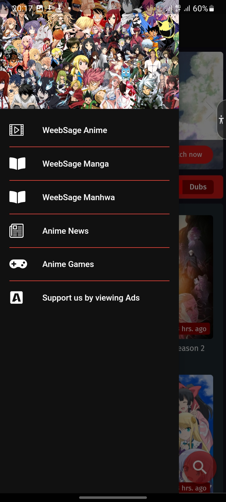

# WeebSage TV 📺

**WeebSage TV** is a powerful Flutter-based mobile application designed to deliver a seamless streaming and browsing experience for anime, manga, and otaku-related content. It combines multiple anime and manga sources in a single app using WebViews, navigation controls, ad integration, and JavaScript DOM manipulation for UI cleanup.

---

## 🚀 Features

- 🌐 Integrated WebView Browser
- 🧠 JavaScript injection for page customization
- 📺 Floating video streaming support for selected providers
- 📂 Side navigation drawer with preloaded websites
- 🔕 Ad-blocker and controlled ad redirects
- ⏳ Initial splash/adscreen with timed redirection
- 📱 Vibrates when video is ready for streaming
- 🎯 Auto-detection of supported stream pages

---

## 🛠 Tech Stack

- **Flutter**
- `webview_flutter`
- `vibration`
- `url_launcher`
- `dart:async`
- JavaScript DOM injection
- Basic custom routing and widget composition

---

## 📸 Screenshots



---

## 📥 Installation

1. Clone the repo:
   ```bash
   git clone https://github.com/your-username/weebsage-tv.git
   cd weebsage-tv
